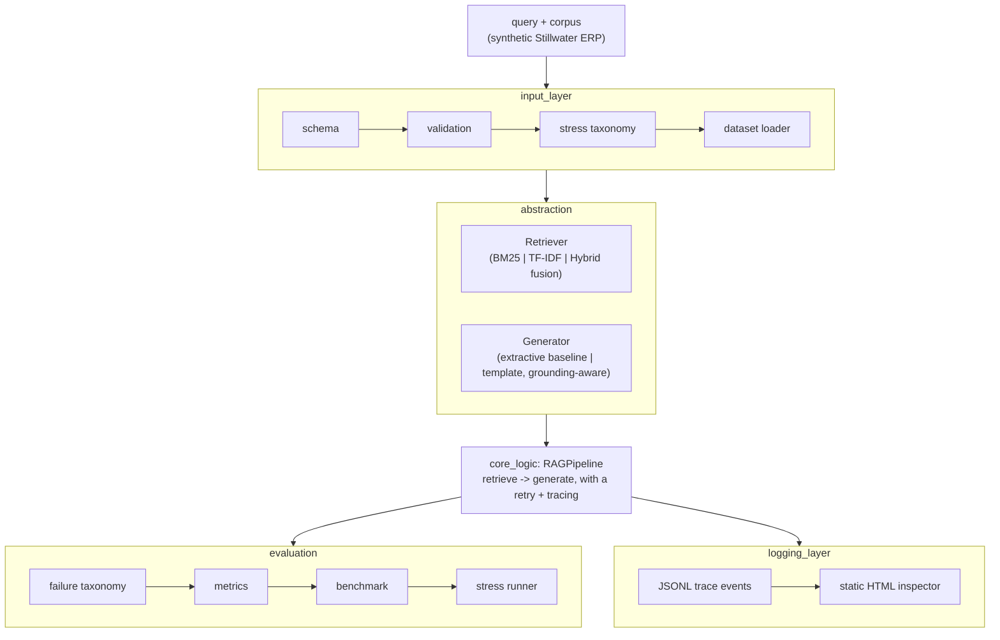

# RAG failure-mode lab

A small offline harness for poking at where retrieval-augmented generation goes
wrong. It runs three retrievers against two generators over a synthetic question
set, buckets each answer into one of a few failure modes, and writes out a
comparison.

No network, no GPU, no API key. BM25 is hand-rolled Okapi, the embedding
retriever is sklearn TF-IDF + cosine, and both "generators" are deterministic
extractive/template things over the retrieved text. There is no LLM in the loop,
which is the whole point: I wanted the failure counting to be reproducible.

The corpus is made up. It's a fictional *Stillwater Industrial* ERP knowledge
base covering order-to-cash, procure-to-pay, and inventory counts.

## What it's measuring

Each query ships with a gold answer and the doc ids that actually answer it. So
for a given retriever+generator combo I can ask: how often is the answer right,
how often does it confidently make something up, how often did retrieval just
miss. The interesting slice is by stress type (adversarial / ambiguous /
long-context), since that's where the cheap baseline falls over.

## Layout



- `src/input_layer/`: typed documents/queries, the loader, stress categories.
- `src/abstraction/`: the three retrievers and two generators behind two ABCs.
- `src/core_logic/rag_pipeline.py`: wires retrieve then generate and traces it.
- `src/evaluation/`: metrics, the failure taxonomy, the suite, the report.
- `src/logging_layer/`: trace events to JSONL plus the HTML dump.

`docs/ARCHITECTURE.md` has the module contracts.

## Retrievers and generators

- `bm25`: pure-Python Okapi BM25, no `rank_bm25`.
- `embedding`: `TfidfVectorizer` + cosine.
- `hybrid`: min-max normalize each, then `alpha*embedding + (1-alpha)*bm25`.
- `extractive` (baseline): returns the single best query-overlap sentence.
  Brittle, it'll answer off-topic queries with whatever was closest.
- `template` (improved): keeps only sentences near the top relevance and
  abstains when nothing is on-topic, which is what kills most of the
  hallucinations on the adversarial/ambiguous queries.

## Running it

```powershell
# from this directory; src/ and shared/ resolve off PYTHONPATH
$env:PYTHONPATH = "$PWD"          # bash: export PYTHONPATH="$PWD"

# the dataset is already committed, but you can rebuild it
python scripts/build_dataset.py

# one query through a chosen combo
python -m src.cli run "What triggers a backorder?" --retriever hybrid --generator template

# every retriever x generator combination, aggregate metrics as JSON
python -m src.cli eval-suite

# the full report -> eval/COMPARISON.md + the two JSON files
python -m src.cli report
python scripts/run_comparative_report.py     # same thing, standalone

python -m pytest tests -q
```

Seed, k, hybrid alpha and the BM25 params live in `config.json`.

## Demonstration

```powershell
python -m src.cli run "What triggers a backorder?" --retriever hybrid --generator template
```

Real output from that command, against the shipped corpus:

```json
{
  "generated_answer": "Based on the context: Posting a shipment decrements on-hand inventory and triggers invoice generation in the billing step. If on-hand quantity is insufficient, the line is partially allocated and a backorder record is created for the remainder.",
  "generator": "template",
  "latency_ms": 3.7059,
  "query_id": "adhoc",
  "query_text": "What triggers a backorder?",
  "retriever": "hybrid",
  "retrieved_ids": ["DOC_O2C_04", "DOC_O2C_03", "DOC_P2P_02", "DOC_INV_03", "DOC_INV_01"]
}
```

The hybrid retriever pulled the shipping doc and the allocation doc first (scores
1.0 and 0.92), which is exactly the pair that explains a backorder, and the
template generator only quoted sentences out of those two. Full per-doc scores
and text come back too, trimmed here for length.

## Metrics

Full definitions live in `docs/METRICS.md`. The code is `src/evaluation/metrics.py`.
Short version: faithfulness (claims grounded in ground truth), context
precision@k, hallucination rate (the one I care about), token-F1 against the
gold answer, and latency percentiles.

Faithfulness and hallucination are scored against the ground truth (gold answer
+ gold context), not against whatever got retrieved. That way an answer pulled
from an off-topic passage still counts as a hallucination, which is the behavior
I was trying to surface.

## Baseline vs improved

Baseline is `bm25 + extractive`: fast, dumb, and happy to answer when nothing
fits. Improved is `hybrid + template`: fusion retrieval plus the abstention.

On the current seed (15 queries) the improved combo drops the hallucination rate
from 0.267 to 0.233, roughly a 12% relative cut, with faithfulness and
correctness about the same. The per-stress-type numbers and the recommendation
land in `eval/COMPARISON.md`.

## Outputs

- `logs/*.jsonl`: one event per pipeline stage, dump to HTML with
  `src/logging_layer/debug_hooks.py`.
- `eval/COMPARISON.md`, `eval/stress_results.json`, `eval/comparison.json`.

## Reproducibility

Everything is seed-locked through `shared/determinism.py`.
`tests/test_determinism_contract.py` runs the suite three times and checks the
metrics, answers and failure modes match (latency excluded, since wall-clock
isn't reproducible).

## Writing hygiene

`scripts/check_prose.py` scans every tracked `.md` and `.py` file for em-dashes,
leaked tool-call artifacts, and a short list of employer/internal-tool terms
that don't belong in this repo. It's stdlib-only and not wired into CI or a git
hook, run it by hand with `python scripts/check_prose.py`.
