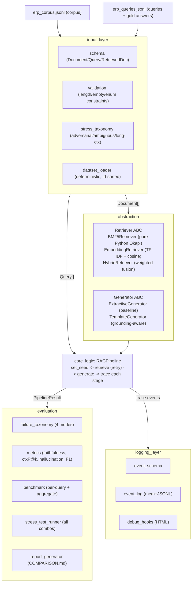

# Architecture

Five packages under `src/`, each with a narrow contract. The evaluation package
composes the rest. Data flows top to bottom.

## Data flow

## Module contracts

- **`Retriever.index(documents) -> self`**, then **`retrieve(query, k) -> list[RetrievedDoc]`**.
  Ranking is by descending score with ties broken by `doc_id` for determinism.
- **`Generator.generate(query, contexts, *, seed) -> str`**. Generators may only
  emit content grounded in `contexts`. With empty contexts they return a fixed
  abstention string.
- **`RAGPipeline.run(query) -> PipelineResult`**. Seeds the run, retries
  retrieval up to `max_retries`, and records one trace event per stage.
- **`classify_failure(...) -> FailureMode`**. Deterministic precedence:
  correct → hallucination → irrelevant_retrieval → context_mismatch →
  partial_correctness.
- **Metrics** are pure functions. Degenerate inputs return `0.0`.

## Grounding

Faithfulness and hallucination are scored against the gold answer plus the gold
context texts, not against whatever the retriever surfaced. That's what lets a
confident answer drawn from an off-topic passage register as a hallucination,
which is the gap between the extractive baseline and the template generator.

## Determinism

`set_seed` runs per pipeline run. Retrievers and generators are pure functions
of (query, corpus). The only non-deterministic thing is wall-clock latency,
which is reported but kept out of the determinism test.
